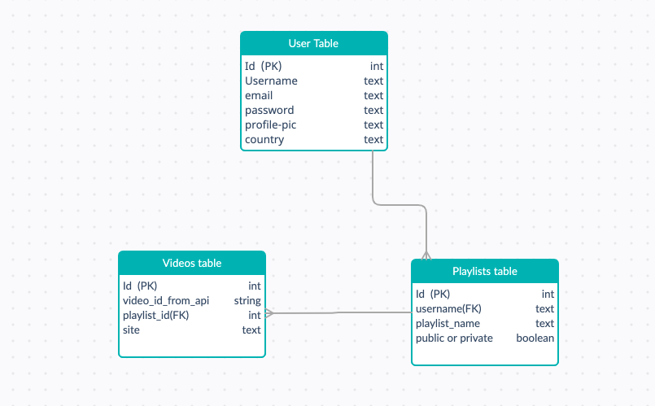
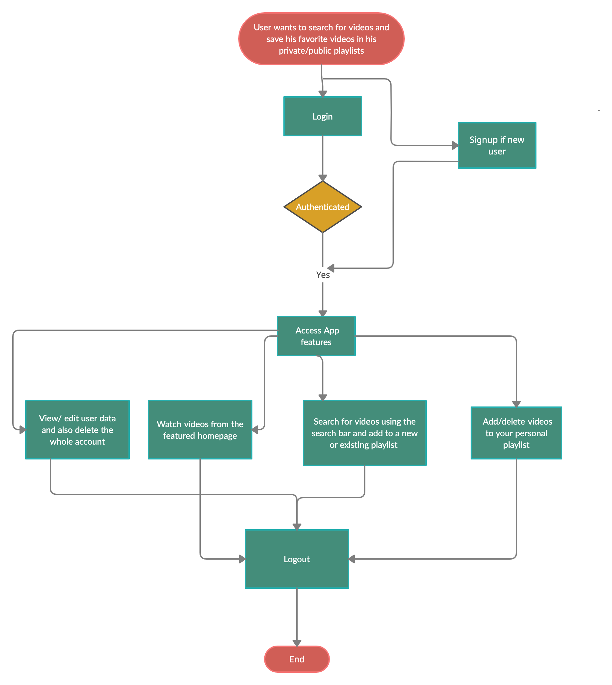
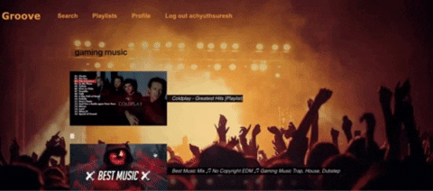

<h1><b>Groove</b></h1>

<h2><b>Description</b></h2>
<p>With many number of video apps like youtube, Vimeo, Twitch etc, we can access all our favorite videos from all these different sites. Groove is a one stop place for all your favorite music from youtube, vimeo and many more. Though currently the app incorporates only videos from youtube, in future it will be including videos from all video apps. Groove allows users to search for their favorite music videos and allows them to add it to their existing playlists or lets them create a new playlist. The users can enjoy  all of their favorite videos from their playlist through Groove without any advertisements.</p>

<h2><b>Features</b></h2>

*  The search feature can be accessed by the user after signing up or logging in
  
*  After logging in  the user can enjoy watching the most popular music videos of that current time from the landing page/homepage.

*  The search feature allows users to search for any of their favorite bands or music videos. The user can watch the videos and add the video to a new or existing playlist if he wants to.

*  The playlists can be marked public or private. The playlist settings can be edited too if the user decides to change his playlist settings in the future.

*  Any video from a playlist can be deleted and the plalist is updated immediately. The user can also delete the entire playlist which in turn deletes all the videos in it.

*  Allows user to edit profile. The account can be deleted too which will simultaneously delete all user data.

<h2><b>Click here to view the app</b></h2>

[Groove](https://many-pear.surge.sh/)

<h2><b>Installation</b></h2>

*  clone repository using command line

``` $ git clone https://github.com/malinichandran/react-groove.git ```


* install npm

```
$ npm install
```
* install nodemon to track changes in the server code

```
 $ npm -i nodemon
``` 
*  start the app in localhost for the server
  
  ```
  $ nodemon server.js
  ```

* start the app in localhost for the client

```
npm start
```

<h2><b>Tests</b></h2>

 *  to run tests, use respective commands in command line
  ```
$   npm test

  ```

<h2><b>API used</b></h2>

Youtube API https://www.googleapis.com/youtube/v3/search


<h2><b>Tech Stack</b></h2>

* Web/Frontend

    * ReactJS| CSS | HTML

* Frontend Libraries/Frameworks

    * Bootstrap | React-Bootstrap
  
* Server/Backend

    * NodeJS | SQL | PostgreSQL
  
* Backend Libraries/Frameworks

    * ExpressJS 


<h2><b>Database Schema</b><h2>




<h2><b>User Work Flow</b></h2>







    

 <h2><b>Groove v 2.0</b></2>       

* Incorporate videos from all music video sites
* Public playlists are recommended to other users  
* Select genre and region for choosing videos      

